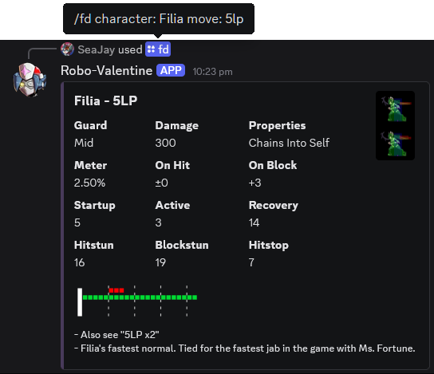

# Robo-Valentine 💉


**🢂 [CLICK HERE to add to your server, or as a personal App](https://discord.com/oauth2/authorize?client_id=1374926026668249168) 🢀**

Discord bot for quickly getting Skullgirls frame data. 100% blind rewrite and
hopeful successor to Liam's Robo-Fortune bot (aka FDBot).

Written in TypeScript with discord.js. Currently hosted on Amazon Lightsail.

Art by [ComicBookGuy](https://x.com/comicbookguy209).

## New shiny improvements

- Robo-Val is fully public for anyone to access, and 100% open source.
- Robo-Val still works as a traditional server bot, but you can also install her
  as an App and take her anywhere!
- Robo-Val's input parsing is more flexible, so you're more likely to get what
  you want.
  - Shorthands for Umbrella's hunger states are now supported, eg. `"rav 2lp"`.
  - Slightly wrong queries like `"beatt extend"` will still work out thanks to
    fuzzy matching.
  - In most cases, Robo-Val will accept any amount of space between words,
    including none. All three of `beat extend`, `beat   extend`  and `beatextend`
    will work.
- That's about it for users, but there are a bunch of internal improvements for
  maintainers as well.

## How to use the bot

`/fd` is a Discord slash command with two parameters (`character` and `move`),
e.g.

```plaintext
/fd character:Filia move:5LP
```

The above should yield the frame data for Filia's 5LP:



The move name is case insensitive, so don't worry about capitalisation.

Alternatively if you just want a big picture of the hitbox, use `/hb` to get only that image
(it's bigger!)

## Where is the data hosted?

Currently hosted as a Google sheet -
[Read-only link to bot data spreadsheet](https://docs.google.com/spreadsheets/d/1WinMvGxS65707Uh2C0-VmDwXVTdav-DEI29j4OyJWXw/edit?usp=sharing).
If you want edit access, contact SeaJay.

If you're reading this in the future and the link above is dead, there are Excel
backups available in the `backups/` folder in this repository. You can download
one of those and upload it as a new Google Sheet, then point your bot towards
that (see "Using your own Google Sheet" below). I also encourage you to make
your own offline backups of the current live version.

## Info for developers

### Loading new data into the bot

When pulling data for a `/fd` query, Robo-Valentine pulls from a local cache
held in a sqlite database instead of pulling from the Google Sheet every time.
This is mainly for performance reasons, and to avoid overuse of the Sheets API.
This also means data needs to be loaded from the Sheet to the cache.

Robo-Valentine uses the `/download` slash command to download new data from the
Google Sheet and load it into the bot's local cache for quick retrieval. If
you're an approved maintainer (contact SeaJay), you can use the command in
Discord to fetch new data.

### Dev setup

You'll need git, NodeJS, and npm. I'm using node `24.1.0`, so try to use the
same version especially if you're encountering any weird errors.

```shell
# clone the respository
git clone https://github.com/hugh-braico/robo-valentine.git
cd robo-valentine

# install Node dependencies
npm i

# copy the template config file to make the real file
cp config/config.json.template config/config.json
```

Make a new bot application in Discord's developer portal (there are many guides
online for this). Open `config/config.json` and fill in the token and Client ID
for your bot. Go through the oauth flow on one of your servers to add the bot,
so you have a channel to test commands with.

Replace the example value in the `approved-maintainers` array in
`config/config.json` with your Discord account's user ID. This just lets your
user account call the `/download` command. The array must have at least one
person's user ID in it.

You can optionally fill in the `activity-channel-id` with the ID of a channel
that Robo-Valentine has access to, and it will dump activity messages there.
Same for the `error-channel-id` which will get dumps with exceptions/errors. The
first person in the maintainers array will get pinged on new error dumps.

Create a Google service account to authenticate against Sheets - follow
[this guide](https://theoephraim.github.io/node-google-spreadsheet/#/guides/authentication).

Place the JSON service account credentials file into
`config/service-account.json`.

Ask SeaJay to grant Viewer permissions to your service account (you will need
to supply the email address of the account). See the next section if you want
to set up your own Sheet.

Register all available slash commands with Discord on all servers:

```shell
npm run deploy-commands
```

Run the bot:

```shell
npm run dev
```

### Production setup

For production hosting, keep in mind that the database is less than 1 MB and
all the bot really does is present it in a user friendly way. The smallest
Lightsail or Heroku instance (etc) is perfectly fine.

The host I'm using at the moment is the smallest Amazon Lightsail instance -
512MB RAM, 2 vCPU, 20GB SSD, and the Bitnami Node.js prebuilt image.

To run a persistent session on a hosted server, where you want the process to
continue after you close the session:

```shell
# (follow instructions in "Dev setup" to clone repo, set up credentials)

# install dependencies
npm ci

# install PM2 globally (only need to do this once)
npm install -g pm2

# start pm2-managed instance
pm2 start ecosystem.config.js
```

Then later you can check on it with

```shell
# shows a list of running services
pm2 ls

# get the last few lines of logs
pm2 logs

# brings up the PM2 monitoring tool if you want to watch for longer
pm2 monit
```

More destructive commands:

```shell
# restart the service eg. to introduce code changes
pm2 restart all

# kill the service
pm2 delete all
```

#### Start robo-valentine as a systemd service

This has the advantage of being able to reboot the machine without having to
manually start Robo-Valentine again.

Update the following in `robo-valentine.service`:

- `User` - username of the host machine 
- `WorkingDirectory` - full path to where you git cloned the repo
- update the `pm2` binary which is `/opt/bitnami/node/bin/pm2` on my setup (use
  `which pm2` to find out where it is for you).
- update the PATH to include the path of your `node` binary.

```shell
# install PM2 globally (only need to do this once)
npm install -g pm2

# copy service file to system
sudo cp robo-valentine.service /etc/systemd/system/

# enable robo-valentine as a service that runs on every startup
sudo systemctl daemon-reload
sudo systemctl enable robo-valentine.service
sudo systemctl start robo-valentine.service

# optional: check the status of this service
sudo systemctl status robo-valentine.service

# You can use the same pm2 commands as before to monitor.
pm2 logs robo-valentine
pm2 monit
```

### Using your own Google Sheet

1. Go through the same process as above to create a service account and save it
   to the same `config/service-account.json` path.
1. Create your own Google Sheet under your own account (use the "Make a copy"
   feature, or upload one of the backup Excel files in `backups/`).
1. Replace the `google-sheet-id` in `config/config.json` with the ID of your new
   Sheet.
1. Share your new Sheet with your service account's email address (give it
   Viewer permissions).

After that, your instance of the bot should be able to download new data using
the `/download` slash command.

## TODO list

- thumbnail and footer URL conditional formatting in the sheet
  - copy annie's formatting to all characters
- refactor fd and hb to not have as much duplicated code